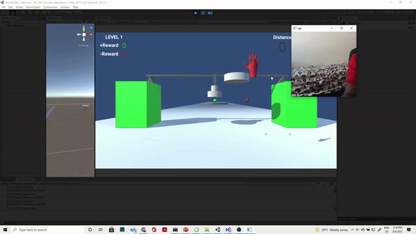
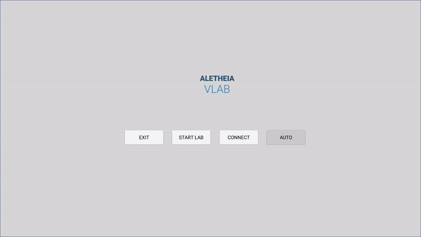
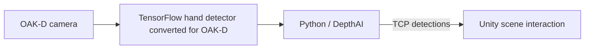
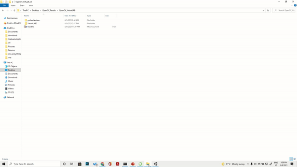

# Hand-Controlled Virtual Lab

**A personal computer vision prototype connecting OAK-D hand detection to a Unity laboratory.**

This project explores how camera-based interaction can control simulated lab equipment. The demonstrated milestone is basic hand-position control; richer gestures and navigation are future work.

Created for the [OpenCV Spatial AI competition in 2021](https://opencv.org/opencv-ai-competition-2021/). Project credited to **Osazee Ero and Osezua Ibhadode**.

## Demo

Hand detection, environment, and hardware recordings

## System design

The work connects model training, device inference, and an interactive application. The motivation is to let learners explore simulated equipment when physical laboratories are difficult to access.

## What is in this repository

- Prototype demo GIFs and an instruction recording.
- A converted model artifact: `ssd_mobilenet_v2_converted_from_tf.blob`.
- Documentation of the training and integration workflow.

**The full Unity project and Python integration scripts are not checked into this repository.** The original project files were shared through the external download below. Cloning this repository alone is not enough to run the complete prototype.

## Original training workflow

1. Train a TensorFlow hand detector using the [EgoHands dataset](http://vision.soic.indiana.edu/projects/egohands/).
2. Export the trained inference graph.
3. Convert it to an OAK-D-compatible blob and load it through DepthAI.
4. Send predicted detections to Unity over a TCP connection.

The original write-up names `ssd_mobilenet_v1_coco` as the training base; the checked-in blob is named `ssd_mobilenet_v2_converted_from_tf.blob`. Confirm the original training configuration before reproducing the model.

Original [model-conversion notebook](https://colab.research.google.com/drive/1Xip9MiWOJyemxyjMDURLXbeJgCzaYR1t).

Dataset reference: Bambach, Sven, et al. *Lending a hand: Detecting hands and recognizing activities in complex egocentric interactions.* ICCV, 2015.

## Running the original prototype

The original environment used **Unity 2019**, an **OAK-D camera**, and the **DepthAI Python module**. These are historical instructions; compatibility with current tool versions and the external download has not been revalidated.

1. Obtain the [original project bundle](https://1drv.ms/u/s!Aq1P6-KG-rfxmaciRX6ARW44x-BSng?e=dCTW9A).
2. Place the model blob in the model directory used by the supplied DepthAI example.
3. Open the `VirtualLab2` project in Unity.
4. Connect the OAK-D camera and run the bundle's `modified_rgb_mobilenet.py` script.
5. Start the Unity simulation and select **Connect**.
6. Test the basic hand-control interaction.

## Scope and next steps

Gesture control remains imperfect. Facial-expression navigation, eye tracking, and richer equipment manipulation were goals, not completed capabilities demonstrated here.

The most useful next improvements are to recover and version the full source, document a reproducible environment, and evaluate gesture accuracy and interaction latency.

## License and credits

[MIT license](LICENSE). Preserve the project and dataset attribution when reusing this work.
